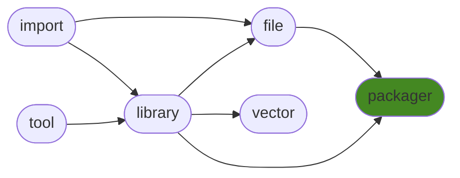

<h1>generalpackager</h1>

Tools to interface GitHub, PyPI, NPM and local modules / repos. Used for generating files to keep projects dry and synced. Tailored for ManderaGeneral for now.

<h2>Table of Contents</h2>

<pre>
<a href='#generalpackager'>generalpackager</a>
├─ <a href='#Dependency-Diagram-for-ManderaGeneral'>Dependency Diagram for ManderaGeneral</a>
├─ <a href='#Installation-showing-dependencies'>Installation showing dependencies</a>
├─ <a href='#Information'>Information</a>
├─ <a href='#Attributes'>Attributes</a>
├─ <a href='#Contributions'>Contributions</a>
└─ <a href='#Todo'>Todo</a>
</pre>

<h2>Dependency Diagram for ManderaGeneral</h2>

<h2>Installation showing dependencies</h2>

| `pip install`                                                                      | `generalpackager`   |
|:-----------------------------------------------------------------------------------|:--------------------|
| <a href='https://pypi.org/project/generallibrary[table]'>generallibrary[table]</a> | ✔️                  |
| <a href='https://pypi.org/project/generalfile'>generalfile</a>                     | ✔️                  |
| <a href='https://pypi.org/project/requests'>requests</a>                           | ✔️                  |
| <a href='https://pypi.org/project/pyinstaller'>pyinstaller</a>                     | ✔️                  |
| <a href='https://pypi.org/project/coverage'>coverage</a>                           | ✔️                  |

<h2>Information</h2>

| Package                                                              | Ver                                                | Latest Release       | Python                                                                                                                                                                                                                                                 | Platform        | Cover   |
|:---------------------------------------------------------------------|:---------------------------------------------------|:---------------------|:-------------------------------------------------------------------------------------------------------------------------------------------------------------------------------------------------------------------------------------------------------|:----------------|:--------|
| [generalpackager](https://github.com/ManderaGeneral/generalpackager) | [0.5.7](https://pypi.org/project/generalpackager/) | 2023-02-02 13:29 CET | [3.8](https://www.python.org/downloads/release/python-380/), [3.9](https://www.python.org/downloads/release/python-390/), [3.10](https://www.python.org/downloads/release/python-3100/), [3.11](https://www.python.org/downloads/release/python-3110/) | Windows, Ubuntu | 68.9 %  |

<h2>Attributes</h2>

<pre>
<a href='https://github.com/ManderaGeneral/generalpackager/blob/master/generalpackager/__init__.py#L1'>Module: generalpackager</a>
├─ <a href='https://github.com/ManderaGeneral/generalpackager/blob/master/generalpackager/api/github.py#L11'>Class: GitHub</a>
│  ├─ <a href='https://github.com/ManderaGeneral/generalpackager/blob/master/generalpackager/api/github.py#L11'>Class: GitHub</a>
│  ├─ <a href='https://github.com/ManderaGeneral/generalpackager/blob/master/generalpackager/api/localmodule.py#L8'>Class: LocalModule</a>
│  ├─ <a href='https://github.com/ManderaGeneral/generalpackager/blob/master/generalpackager/api/localrepo/base/localrepo.py#L16'>Class: LocalRepo</a>
│  ├─ <a href='https://github.com/ManderaGeneral/generalpackager/blob/master/generalpackager/packager.py#L22'>Class: Packager</a>
│  ├─ <a href='https://github.com/ManderaGeneral/generalpackager/blob/master/generalpackager/api/pypi.py#L26'>Class: PyPI</a>
│  ├─ <a href='https://github.com/ManderaGeneral/generalpackager/blob/master/generalpackager/api/github.py#L27'>Method: api_url</a>
│  ├─ <a href='https://github.com/ManderaGeneral/generalpackager/blob/master/generalpackager/api/github.py#L43'>Method: download</a>
│  ├─ <a href='https://github.com/ManderaGeneral/generalpackager/blob/master/generalpackager/api/github.py#L39'>Method: exists</a>
│  ├─ <a href='https://github.com/ManderaGeneral/generalpackager/blob/master/generalpackager/api/github.py#L96'>Method: get_description</a>
│  ├─ <a href='https://github.com/ManderaGeneral/generalpackager/blob/master/generalpackager/api/github.py#L64'>Method: get_owners_packages</a>
│  ├─ <a href='https://github.com/ManderaGeneral/generalpackager/blob/master/generalpackager/api/github.py#L83'>Method: get_topics</a>
│  ├─ <a href='https://github.com/ManderaGeneral/generalpackager/blob/master/generalpackager/api/github.py#L71'>Method: get_website</a>
│  ├─ <a href='https://github.com/ManderaGeneral/generalpackager/blob/master/generalpackager/api/github.py#L32'>Property: git_clone_command</a>
│  ├─ <a href='https://github.com/ManderaGeneral/generalpackager/blob/master/generalpackager/api/github.py#L36'>Property: pip_install_command</a>
│  ├─ <a href='https://github.com/ManderaGeneral/generalpackager/blob/master/generalpackager/api/github.py#L108'>Method: request_kwargs</a>
│  ├─ <a href='https://github.com/ManderaGeneral/generalpackager/blob/master/generalpackager/api/github.py#L102'>Method: set_description</a>
│  ├─ <a href='https://github.com/ManderaGeneral/generalpackager/blob/master/generalpackager/api/github.py#L89'>Method: set_topics</a>
│  ├─ <a href='https://github.com/ManderaGeneral/generalpackager/blob/master/generalpackager/api/github.py#L77'>Method: set_website</a>
│  ├─ <a href='https://github.com/ManderaGeneral/generalpackager/blob/master/generalpackager/api/github.py#L24'>Property: ssh_url</a>
│  └─ <a href='https://github.com/ManderaGeneral/generalpackager/blob/master/generalpackager/api/github.py#L20'>Property: url</a>
├─ <a href='https://github.com/ManderaGeneral/generalpackager/blob/master/generalpackager/api/localmodule.py#L8'>Class: LocalModule</a>
│  ├─ <a href='https://github.com/ManderaGeneral/generalpackager/blob/master/generalpackager/api/github.py#L11'>Class: GitHub</a>
│  ├─ <a href='https://github.com/ManderaGeneral/generalpackager/blob/master/generalpackager/api/localmodule.py#L8'>Class: LocalModule</a>
│  ├─ <a href='https://github.com/ManderaGeneral/generalpackager/blob/master/generalpackager/api/localrepo/base/localrepo.py#L16'>Class: LocalRepo</a>
│  ├─ <a href='https://github.com/ManderaGeneral/generalpackager/blob/master/generalpackager/packager.py#L22'>Class: Packager</a>
│  ├─ <a href='https://github.com/ManderaGeneral/generalpackager/blob/master/generalpackager/api/pypi.py#L26'>Class: PyPI</a>
│  ├─ <a href='https://github.com/ManderaGeneral/generalpackager/blob/master/generalpackager/api/localmodule.py#L26'>Method: exists</a>
│  ├─ <a href='https://github.com/ManderaGeneral/generalpackager/blob/master/generalpackager/api/localmodule.py#L67'>Method: get_all_local_modules</a>
│  ├─ <a href='https://github.com/ManderaGeneral/generalpackager/blob/master/generalpackager/api/localmodule.py#L89'>Method: get_dependants</a>
│  ├─ <a href='https://github.com/ManderaGeneral/generalpackager/blob/master/generalpackager/api/localmodule.py#L74'>Method: get_dependencies</a>
│  ├─ <a href='https://github.com/ManderaGeneral/generalpackager/blob/master/generalpackager/api/localmodule.py#L20'>Property: module</a>
│  ├─ <a href='https://github.com/ManderaGeneral/generalpackager/blob/master/generalpackager/api/localmodule.py#L41'>Property: objInfo</a>
│  └─ <a href='https://github.com/ManderaGeneral/generalpackager/blob/master/#L426'>Property: path</a>
├─ <a href='https://github.com/ManderaGeneral/generalpackager/blob/master/generalpackager/api/localrepo/base/localrepo.py#L16'>Class: LocalRepo</a>
│  ├─ <a href='https://github.com/ManderaGeneral/generalpackager/blob/master/generalpackager/api/github.py#L11'>Class: GitHub</a>
│  ├─ <a href='https://github.com/ManderaGeneral/generalpackager/blob/master/generalpackager/api/localmodule.py#L8'>Class: LocalModule</a>
│  ├─ <a href='https://github.com/ManderaGeneral/generalpackager/blob/master/generalpackager/api/localrepo/base/localrepo.py#L16'>Class: LocalRepo</a>
│  ├─ <a href='https://github.com/ManderaGeneral/generalpackager/blob/master/generalpackager/packager.py#L22'>Class: Packager</a>
│  ├─ <a href='https://github.com/ManderaGeneral/generalpackager/blob/master/generalpackager/api/pypi.py#L26'>Class: PyPI</a>
│  ├─ <a href='https://github.com/ManderaGeneral/generalpackager/blob/master/generalpackager/api/localrepo/base/targets.py#L4'>Class: Targets</a>
│  ├─ <a href='https://github.com/ManderaGeneral/generalpackager/blob/master/generalpackager/api/shared/decos.py#L4'>Method: changed_files</a>
│  ├─ <a href='https://github.com/ManderaGeneral/generalpackager/blob/master/generalpackager/api/shared/decos.py#L4'>Method: clone</a>
│  ├─ <a href='https://github.com/ManderaGeneral/generalpackager/blob/master/generalpackager/api/shared/decos.py#L4'>Method: commit</a>
│  ├─ <a href='https://github.com/ManderaGeneral/generalpackager/blob/master/generalpackager/api/localrepo/base/localrepo_git.py#L12'>Method: commit_message</a>
│  ├─ <a href='https://github.com/ManderaGeneral/generalpackager/blob/master/generalpackager/api/shared/decos.py#L4'>Method: commit_sha</a>
│  ├─ <a href='https://github.com/ManderaGeneral/generalpackager/blob/master/generalpackager/api/localrepo/base/localrepo_git.py#L72'>Method: commit_sha_short</a>
│  ├─ <a href='https://github.com/ManderaGeneral/generalpackager/blob/master/generalpackager/api/localrepo/base/localrepo.py#L55'>Method: exists</a>
│  ├─ <a href='https://github.com/ManderaGeneral/generalpackager/blob/master/generalpackager/api/localrepo/base/localrepo.py#L114'>Method: format_file</a>
│  ├─ <a href='https://github.com/ManderaGeneral/generalpackager/blob/master/generalpackager/api/localrepo/base/localrepo_paths.py#L92'>Method: get_examples_path</a>
│  ├─ <a href='https://github.com/ManderaGeneral/generalpackager/blob/master/generalpackager/api/localrepo/base/localrepo_paths.py#L60'>Method: get_exeproduct_path</a>
│  ├─ <a href='https://github.com/ManderaGeneral/generalpackager/blob/master/generalpackager/api/localrepo/base/localrepo_paths.py#L56'>Method: get_exetarget_path</a>
│  ├─ <a href='https://github.com/ManderaGeneral/generalpackager/blob/master/generalpackager/api/localrepo/base/localrepo_paths.py#L52'>Method: get_generate_path</a>
│  ├─ <a href='https://github.com/ManderaGeneral/generalpackager/blob/master/generalpackager/api/localrepo/base/localrepo_paths.py#L16'>Method: get_git_exclude_path</a>
│  ├─ <a href='https://github.com/ManderaGeneral/generalpackager/blob/master/generalpackager/api/localrepo/base/localrepo_paths.py#L64'>Method: get_git_ignore_path</a>
│  ├─ <a href='https://github.com/ManderaGeneral/generalpackager/blob/master/generalpackager/api/localrepo/base/localrepo_paths.py#L72'>Method: get_index_js_path</a>
│  ├─ <a href='https://github.com/ManderaGeneral/generalpackager/blob/master/generalpackager/api/localrepo/base/localrepo_paths.py#L44'>Method: get_init_path</a>
│  ├─ <a href='https://github.com/ManderaGeneral/generalpackager/blob/master/generalpackager/api/localrepo/base/localrepo_paths.py#L28'>Method: get_license_path</a>
│  ├─ <a href='https://github.com/ManderaGeneral/generalpackager/blob/master/generalpackager/api/localrepo/base/localrepo_paths.py#L24'>Method: get_manifest_path</a>
│  ├─ <a href='https://github.com/ManderaGeneral/generalpackager/blob/master/generalpackager/api/localrepo/base/localrepo_paths.py#L12'>Method: get_metadata_path</a>
│  ├─ <a href='https://github.com/ManderaGeneral/generalpackager/blob/master/generalpackager/api/localrepo/base/localrepo_paths.py#L68'>Method: get_npm_ignore_path</a>
│  ├─ <a href='https://github.com/ManderaGeneral/generalpackager/blob/master/generalpackager/api/localrepo/base/localrepo_paths.py#L8'>Method: get_org_readme_path</a>
│  ├─ <a href='https://github.com/ManderaGeneral/generalpackager/blob/master/generalpackager/api/localrepo/base/localrepo_paths.py#L80'>Method: get_package_json_path</a>
│  ├─ <a href='https://github.com/ManderaGeneral/generalpackager/blob/master/generalpackager/api/localrepo/base/localrepo.py#L72'>Method: get_package_paths_gen</a>
│  ├─ <a href='https://github.com/ManderaGeneral/generalpackager/blob/master/generalpackager/api/localrepo/base/localrepo_paths.py#L84'>Method: get_pre_commit_hook_path</a>
│  ├─ <a href='https://github.com/ManderaGeneral/generalpackager/blob/master/generalpackager/api/localrepo/base/localrepo_paths.py#L88'>Method: get_pre_push_hook_path</a>
│  ├─ <a href='https://github.com/ManderaGeneral/generalpackager/blob/master/generalpackager/api/localrepo/base/localrepo_paths.py#L48'>Method: get_randomtesting_path</a>
│  ├─ <a href='https://github.com/ManderaGeneral/generalpackager/blob/master/generalpackager/api/localrepo/base/localrepo_paths.py#L4'>Method: get_readme_path</a>
│  ├─ <a href='https://github.com/ManderaGeneral/generalpackager/blob/master/generalpackager/api/localrepo/base/localrepo_paths.py#L20'>Method: get_setup_path</a>
│  ├─ <a href='https://github.com/ManderaGeneral/generalpackager/blob/master/generalpackager/api/localrepo/base/localrepo_paths.py#L76'>Method: get_test_js_path</a>
│  ├─ <a href='https://github.com/ManderaGeneral/generalpackager/blob/master/generalpackager/api/localrepo/base/localrepo_paths.py#L36'>Method: get_test_path</a>
│  ├─ <a href='https://github.com/ManderaGeneral/generalpackager/blob/master/generalpackager/api/localrepo/base/localrepo.py#L66'>Method: get_test_paths</a>
│  ├─ <a href='https://github.com/ManderaGeneral/generalpackager/blob/master/generalpackager/api/localrepo/base/localrepo_paths.py#L40'>Method: get_test_template_path</a>
│  ├─ <a href='https://github.com/ManderaGeneral/generalpackager/blob/master/generalpackager/api/localrepo/base/localrepo_paths.py#L32'>Method: get_workflow_path</a>
│  ├─ <a href='https://github.com/ManderaGeneral/generalpackager/blob/master/generalpackager/api/localrepo/base/localrepo_git.py#L29'>Method: git_config</a>
│  ├─ <a href='https://github.com/ManderaGeneral/generalpackager/blob/master/generalpackager/api/localrepo/base/localrepo_git.py#L21'>Method: git_missing_credentials</a>
│  ├─ <a href='https://github.com/ManderaGeneral/generalpackager/blob/master/generalpackager/api/localrepo/base/localrepo_git.py#L25'>Method: git_nothing_to_commit</a>
│  ├─ <a href='https://github.com/ManderaGeneral/generalpackager/blob/master/generalpackager/api/shared/decos.py#L4'>Method: init</a>
│  ├─ <a href='https://github.com/ManderaGeneral/generalpackager/blob/master/generalpackager/api/localrepo/base/localrepo_target.py#L18'>Method: is_django</a>
│  ├─ <a href='https://github.com/ManderaGeneral/generalpackager/blob/master/generalpackager/api/localrepo/base/localrepo_target.py#L22'>Method: is_exe</a>
│  ├─ <a href='https://github.com/ManderaGeneral/generalpackager/blob/master/generalpackager/api/shared/name.py#L41'>Method: is_general</a>
│  ├─ <a href='https://github.com/ManderaGeneral/generalpackager/blob/master/generalpackager/api/localrepo/base/localrepo_target.py#L14'>Method: is_node</a>
│  ├─ <a href='https://github.com/ManderaGeneral/generalpackager/blob/master/generalpackager/api/localrepo/base/localrepo_target.py#L10'>Method: is_python</a>
│  ├─ <a href='https://github.com/ManderaGeneral/generalpackager/blob/master/generalpackager/api/localrepo/base/localrepo.py#L33'>Property: metadata</a>
│  ├─ <a href='https://github.com/ManderaGeneral/generalpackager/blob/master/generalpackager/api/localrepo/base/localrepo.py#L48'>Method: metadata_exists</a>
│  ├─ <a href='https://github.com/ManderaGeneral/generalpackager/blob/master/generalpackager/api/shared/name.py#L37'>Method: name_is_general</a>
│  ├─ <a href='https://github.com/ManderaGeneral/generalpackager/blob/master/generalpackager/api/shared/decos.py#L4'>Method: push</a>
│  ├─ <a href='https://github.com/ManderaGeneral/generalpackager/blob/master/generalpackager/api/localrepo/base/localrepo.py#L60'>Method: repo_exists</a>
│  ├─ <a href='https://github.com/ManderaGeneral/generalpackager/blob/master/generalpackager/api/shared/name.py#L46'>Property: simple_name</a>
│  ├─ <a href='https://github.com/ManderaGeneral/generalpackager/blob/master/generalpackager/api/localrepo/base/localrepo.py#L42'>Property: target</a>
│  └─ <a href='https://github.com/ManderaGeneral/generalpackager/blob/master/generalpackager/api/localrepo/base/localrepo_target.py#L49'>Method: targetted</a>
├─ <a href='https://github.com/ManderaGeneral/generalpackager/blob/master/generalpackager/api/localrepo/node/localrepo_node.py#L6'>Class: LocalRepo_Node</a>
├─ <a href='https://github.com/ManderaGeneral/generalpackager/blob/master/generalpackager/api/localrepo/python/localrepo_python.py#L11'>Class: LocalRepo_Python</a>
│  ├─ <a href='https://github.com/ManderaGeneral/generalpackager/blob/master/generalpackager/api/localrepo/python/localrepo_python.py#L16'>Method: get_python_exe_path</a>
│  └─ <a href='https://github.com/ManderaGeneral/generalpackager/blob/master/generalpackager/api/localrepo/python/localrepo_python.py#L21'>Method: unittest</a>
├─ <a href='https://github.com/ManderaGeneral/generalpackager/blob/master/generalpackager/packager.py#L22'>Class: Packager</a>
│  ├─ <a href='https://github.com/ManderaGeneral/generalpackager/blob/master/generalpackager/api/github.py#L11'>Class: GitHub</a>
│  ├─ <a href='https://github.com/ManderaGeneral/generalpackager/blob/master/generalpackager/api/localmodule.py#L8'>Class: LocalModule</a>
│  ├─ <a href='https://github.com/ManderaGeneral/generalpackager/blob/master/generalpackager/api/localrepo/base/localrepo.py#L16'>Class: LocalRepo</a>
│  ├─ <a href='https://github.com/ManderaGeneral/generalpackager/blob/master/generalpackager/packager.py#L22'>Class: Packager</a>
│  ├─ <a href='https://github.com/ManderaGeneral/generalpackager/blob/master/generalpackager/other/packages.py#L9'>Class: Packages</a>
│  │  └─ <a href='https://github.com/ManderaGeneral/generalpackager/blob/master/generalpackager/other/packages.py#L34'>Method: all_packages</a>
│  ├─ <a href='https://github.com/ManderaGeneral/generalpackager/blob/master/generalpackager/api/pypi.py#L26'>Class: PyPI</a>
│  ├─ <a href='https://github.com/ManderaGeneral/generalpackager/blob/master/generalpackager/api/localrepo/base/targets.py#L4'>Class: Targets</a>
│  ├─ <a href='https://github.com/ManderaGeneral/generalpackager/blob/master/generalpackager/packager_github.py#L20'>Method: commit_and_push</a>
│  ├─ <a href='https://github.com/ManderaGeneral/generalpackager/blob/master/generalpackager/api/shared/files/definitions/commit_editmsg.py#L5'>Class: commit_editmsg_file</a>
│  ├─ <a href='https://github.com/ManderaGeneral/generalpackager/blob/master/generalpackager/packager_files.py#L46'>Method: compare_local_to_github</a>
│  ├─ <a href='https://github.com/ManderaGeneral/generalpackager/blob/master/generalpackager/packager_files.py#L53'>Method: compare_local_to_pypi</a>
│  ├─ <a href='https://github.com/ManderaGeneral/generalpackager/blob/master/generalpackager/packager_files.py#L8'>Method: create_blank_locally_python</a>
│  ├─ <a href='https://github.com/ManderaGeneral/generalpackager/blob/master/generalpackager/packager_github.py#L32'>Method: create_github_repo</a>
│  ├─ <a href='https://github.com/ManderaGeneral/generalpackager/blob/master/generalpackager/packager_github.py#L36'>Method: create_master_branch</a>
│  ├─ <a href='https://github.com/ManderaGeneral/generalpackager/blob/master/generalpackager/api/shared/files/definitions/examples.py#L5'>Class: examples_folder</a>
│  ├─ <a href='https://github.com/ManderaGeneral/generalpackager/blob/master/generalpackager/api/shared/files/definitions/exeproduct.py#L5'>Class: exeproduct_folder</a>
│  ├─ <a href='https://github.com/ManderaGeneral/generalpackager/blob/master/generalpackager/api/shared/files/definitions/exetarget.py#L5'>Class: exetarget_file</a>
│  ├─ <a href='https://github.com/ManderaGeneral/generalpackager/blob/master/generalpackager/packager_relations.py#L77'>Method: general_bumped_set</a>
│  ├─ <a href='https://github.com/ManderaGeneral/generalpackager/blob/master/generalpackager/packager_relations.py#L85'>Method: general_changed_dict</a>
│  ├─ <a href='https://github.com/ManderaGeneral/generalpackager/blob/master/generalpackager/api/shared/files/definitions/generate.py#L6'>Class: generate_file</a>
│  ├─ <a href='https://github.com/ManderaGeneral/generalpackager/blob/master/generalpackager/packager_files.py#L69'>Method: generate_localfiles</a>
│  ├─ <a href='https://github.com/ManderaGeneral/generalpackager/blob/master/generalpackager/packager_metadata.py#L27'>Method: get_classifiers</a>
│  ├─ <a href='https://github.com/ManderaGeneral/generalpackager/blob/master/generalpackager/packager_relations.py#L38'>Method: get_dependants</a>
│  ├─ <a href='https://github.com/ManderaGeneral/generalpackager/blob/master/generalpackager/packager_relations.py#L23'>Method: get_dependencies</a>
│  ├─ <a href='https://github.com/ManderaGeneral/generalpackager/blob/master/generalpackager/api/shared/files/shared_files.py#L29'>Method: get_file_from_path</a>
│  ├─ <a href='https://github.com/ManderaGeneral/generalpackager/blob/master/generalpackager/api/shared/files/shared_files.py#L13'>Method: get_filenames</a>
│  ├─ <a href='https://github.com/ManderaGeneral/generalpackager/blob/master/generalpackager/api/shared/files/shared_files.py#L19'>Method: get_files</a>
│  ├─ <a href='https://github.com/ManderaGeneral/generalpackager/blob/master/generalpackager/api/shared/files/shared_files.py#L24'>Method: get_files_by_relative_path</a>
│  ├─ <a href='https://github.com/ManderaGeneral/generalpackager/blob/master/generalpackager/packager_pypi.py#L8'>Method: get_latest_release</a>
│  ├─ <a href='https://github.com/ManderaGeneral/generalpackager/blob/master/generalpackager/packager_relations.py#L49'>Method: get_ordered_packagers</a>
│  ├─ <a href='https://github.com/ManderaGeneral/generalpackager/blob/master/generalpackager/packager_relations.py#L71'>Method: get_owners_package_names</a>
│  ├─ <a href='https://github.com/ManderaGeneral/generalpackager/blob/master/generalpackager/packager_metadata.py#L4'>Method: get_topics</a>
│  ├─ <a href='https://github.com/ManderaGeneral/generalpackager/blob/master/generalpackager/api/shared/files/definitions/git_exclude.py#L5'>Class: git_exclude_file</a>
│  ├─ <a href='https://github.com/ManderaGeneral/generalpackager/blob/master/generalpackager/packager_api.py#L81'>Property: github</a>
│  ├─ <a href='https://github.com/ManderaGeneral/generalpackager/blob/master/generalpackager/packager_api.py#L47'>Method: github_available</a>
│  ├─ <a href='https://github.com/ManderaGeneral/generalpackager/blob/master/generalpackager/packager_workflow.py#L64'>Method: if_publish_bump</a>
│  ├─ <a href='https://github.com/ManderaGeneral/generalpackager/blob/master/generalpackager/packager_workflow.py#L71'>Method: if_publish_upload</a>
│  ├─ <a href='https://github.com/ManderaGeneral/generalpackager/blob/master/generalpackager/api/shared/files/definitions/index_js.py#L6'>Class: index_js_file</a>
│  ├─ <a href='https://github.com/ManderaGeneral/generalpackager/blob/master/generalpackager/api/shared/files/definitions/init.py#L6'>Class: init_file</a>
│  ├─ <a href='https://github.com/ManderaGeneral/generalpackager/blob/master/generalpackager/packager_metadata.py#L33'>Method: is_bumped</a>
│  ├─ <a href='https://github.com/ManderaGeneral/generalpackager/blob/master/generalpackager/api/localrepo/base/localrepo_target.py#L18'>Method: is_django</a>
│  ├─ <a href='https://github.com/ManderaGeneral/generalpackager/blob/master/generalpackager/api/localrepo/base/localrepo_target.py#L22'>Method: is_exe</a>
│  ├─ <a href='https://github.com/ManderaGeneral/generalpackager/blob/master/generalpackager/api/shared/name.py#L41'>Method: is_general</a>
│  ├─ <a href='https://github.com/ManderaGeneral/generalpackager/blob/master/generalpackager/api/localrepo/base/localrepo_target.py#L14'>Method: is_node</a>
│  ├─ <a href='https://github.com/ManderaGeneral/generalpackager/blob/master/generalpackager/api/localrepo/base/localrepo_target.py#L10'>Method: is_python</a>
│  ├─ <a href='https://github.com/ManderaGeneral/generalpackager/blob/master/generalpackager/api/shared/files/definitions/license.py#L6'>Class: license_file</a>
│  ├─ <a href='https://github.com/ManderaGeneral/generalpackager/blob/master/generalpackager/packager_api.py#L88'>Property: localmodule</a>
│  ├─ <a href='https://github.com/ManderaGeneral/generalpackager/blob/master/generalpackager/packager_api.py#L52'>Method: localmodule_available</a>
│  ├─ <a href='https://github.com/ManderaGeneral/generalpackager/blob/master/generalpackager/packager_api.py#L71'>Property: localrepo</a>
│  ├─ <a href='https://github.com/ManderaGeneral/generalpackager/blob/master/generalpackager/packager_api.py#L42'>Method: localrepo_available</a>
│  ├─ <a href='https://github.com/ManderaGeneral/generalpackager/blob/master/generalpackager/api/shared/files/definitions/manifest.py#L5'>Class: manifest_file</a>
│  ├─ <a href='https://github.com/ManderaGeneral/generalpackager/blob/master/generalpackager/api/shared/files/definitions/metadata.py#L5'>Class: metadata_file</a>
│  ├─ <a href='https://github.com/ManderaGeneral/generalpackager/blob/master/generalpackager/api/shared/name.py#L37'>Method: name_is_general</a>
│  ├─ <a href='https://github.com/ManderaGeneral/generalpackager/blob/master/generalpackager/packager_environment.py#L9'>Method: new_clean_environment</a>
│  ├─ <a href='https://github.com/ManderaGeneral/generalpackager/blob/master/generalpackager/api/shared/files/definitions/npm_ignore.py#L5'>Class: npm_ignore_file</a>
│  ├─ <a href='https://github.com/ManderaGeneral/generalpackager/blob/master/generalpackager/api/shared/files/definitions/org_readme.py#L6'>Class: org_readme_file</a>
│  ├─ <a href='https://github.com/ManderaGeneral/generalpackager/blob/master/generalpackager/api/shared/files/definitions/package_json.py#L6'>Class: package_json_file</a>
│  ├─ <a href='https://github.com/ManderaGeneral/generalpackager/blob/master/generalpackager/packager_relations.py#L11'>Method: packagers_from_packages</a>
│  ├─ <a href='https://github.com/ManderaGeneral/generalpackager/blob/master/generalpackager/api/shared/files/definitions/pre_commit_hook.py#L4'>Class: pre_commit_hook_file</a>
│  ├─ <a href='https://github.com/ManderaGeneral/generalpackager/blob/master/generalpackager/api/shared/files/definitions/pre_push_hook.py#L6'>Class: pre_push_hook_file</a>
│  ├─ <a href='https://github.com/ManderaGeneral/generalpackager/blob/master/generalpackager/packager_github.py#L14'>Method: push</a>
│  ├─ <a href='https://github.com/ManderaGeneral/generalpackager/blob/master/generalpackager/packager_api.py#L95'>Property: pypi</a>
│  ├─ <a href='https://github.com/ManderaGeneral/generalpackager/blob/master/generalpackager/packager_api.py#L60'>Method: pypi_available</a>
│  ├─ <a href='https://github.com/ManderaGeneral/generalpackager/blob/master/generalpackager/api/shared/files/definitions/randomtesting.py#L6'>Class: randomtesting_file</a>
│  ├─ <a href='https://github.com/ManderaGeneral/generalpackager/blob/master/generalpackager/api/shared/files/definitions/readme.py#L9'>Class: readme_file</a>
│  ├─ <a href='https://github.com/ManderaGeneral/generalpackager/blob/master/generalpackager/packager_pypi.py#L23'>Method: reserve_name</a>
│  ├─ <a href='https://github.com/ManderaGeneral/generalpackager/blob/master/generalpackager/packager_workflow.py#L18'>Method: run_ordered_methods</a>
│  ├─ <a href='https://github.com/ManderaGeneral/generalpackager/blob/master/generalpackager/api/shared/files/definitions/setup.py#L6'>Class: setup_file</a>
│  ├─ <a href='https://github.com/ManderaGeneral/generalpackager/blob/master/generalpackager/api/shared/name.py#L46'>Property: simple_name</a>
│  ├─ <a href='https://github.com/ManderaGeneral/generalpackager/blob/master/generalpackager/packager.py#L46'>Method: summary_packagers</a>
│  ├─ <a href='https://github.com/ManderaGeneral/generalpackager/blob/master/generalpackager/packager_github.py#L6'>Method: sync_github_metadata</a>
│  ├─ <a href='https://github.com/ManderaGeneral/generalpackager/blob/master/generalpackager/packager_metadata.py#L47'>Property: target</a>
│  ├─ <a href='https://github.com/ManderaGeneral/generalpackager/blob/master/generalpackager/api/shared/files/definitions/test.py#L5'>Class: test_folder</a>
│  ├─ <a href='https://github.com/ManderaGeneral/generalpackager/blob/master/generalpackager/api/shared/files/definitions/test_js.py#L6'>Class: test_js_file</a>
│  ├─ <a href='https://github.com/ManderaGeneral/generalpackager/blob/master/generalpackager/api/shared/files/definitions/test_template.py#L6'>Class: test_template_file</a>
│  ├─ <a href='https://github.com/ManderaGeneral/generalpackager/blob/master/generalpackager/packager_workflow.py#L59'>Method: upload_package_summary</a>
│  ├─ <a href='https://github.com/ManderaGeneral/generalpackager/blob/master/generalpackager/api/shared/files/definitions/workflow.py#L6'>Class: workflow_file</a>
│  ├─ <a href='https://github.com/ManderaGeneral/generalpackager/blob/master/generalpackager/packager_workflow.py#L8'>Method: workflow_sync</a>
│  └─ <a href='https://github.com/ManderaGeneral/generalpackager/blob/master/generalpackager/packager_workflow.py#L8'>Method: workflow_unittest</a>
└─ <a href='https://github.com/ManderaGeneral/generalpackager/blob/master/generalpackager/api/pypi.py#L26'>Class: PyPI</a>
   ├─ <a href='https://github.com/ManderaGeneral/generalpackager/blob/master/generalpackager/api/github.py#L11'>Class: GitHub</a>
   ├─ <a href='https://github.com/ManderaGeneral/generalpackager/blob/master/generalpackager/api/localmodule.py#L8'>Class: LocalModule</a>
   ├─ <a href='https://github.com/ManderaGeneral/generalpackager/blob/master/generalpackager/api/localrepo/base/localrepo.py#L16'>Class: LocalRepo</a>
   ├─ <a href='https://github.com/ManderaGeneral/generalpackager/blob/master/generalpackager/packager.py#L22'>Class: Packager</a>
   ├─ <a href='https://github.com/ManderaGeneral/generalpackager/blob/master/generalpackager/api/pypi.py#L26'>Class: PyPI</a>
   ├─ <a href='https://github.com/ManderaGeneral/generalpackager/blob/master/generalpackager/api/pypi.py#L47'>Method: download</a>
   ├─ <a href='https://github.com/ManderaGeneral/generalpackager/blob/master/generalpackager/api/pypi.py#L37'>Method: exists</a>
   ├─ <a href='https://github.com/ManderaGeneral/generalpackager/blob/master/generalpackager/api/pypi.py#L70'>Method: get_date</a>
   ├─ <a href='https://github.com/ManderaGeneral/generalpackager/blob/master/generalpackager/api/pypi.py#L59'>Method: get_owners_packages</a>
   ├─ <a href='https://github.com/ManderaGeneral/generalpackager/blob/master/generalpackager/api/pypi.py#L41'>Method: get_tarball_url</a>
   ├─ <a href='https://github.com/ManderaGeneral/generalpackager/blob/master/generalpackager/api/pypi.py#L63'>Method: get_version</a>
   └─ <a href='https://github.com/ManderaGeneral/generalpackager/blob/master/generalpackager/api/pypi.py#L34'>Property: url</a>
</pre>

<h2>Contributions</h2>

Issue-creation and discussions are most welcome!

Pull requests are currently not wanted, please discuss with me before investing any time

<h2>Todo</h2>

| Module                                                                                                                                                      | Message                                                                                                                                                                                                          |
|:------------------------------------------------------------------------------------------------------------------------------------------------------------|:-----------------------------------------------------------------------------------------------------------------------------------------------------------------------------------------------------------------|
| <a href='https://github.com/ManderaGeneral/generalpackager/blob/master/generalpackager/packager_files.py#L1'>packager_files.py</a>                          | <a href='https://github.com/ManderaGeneral/generalpackager/blob/master/generalpackager/packager_files.py#L10'>Fix create_blank, it overwrites current projects pip install.</a>                                  |
| <a href='https://github.com/ManderaGeneral/generalpackager/blob/master/generalpackager/api/localrepo/python/localrepo_python.py#L1'>localrepo_python.py</a> | <a href='https://github.com/ManderaGeneral/generalpackager/blob/master/generalpackager/api/localrepo/python/localrepo_python.py#L55'>Make sure twine is installed when trying to upload to pypi.</a>             |
| <a href='https://github.com/ManderaGeneral/generalpackager/blob/master/generalpackager/api/localrepo/python/localrepo_python.py#L1'>localrepo_python.py</a> | <a href='https://github.com/ManderaGeneral/generalpackager/blob/master/generalpackager/api/localrepo/python/localrepo_python.py#L56'>Look into private PyPI server where we could also do dry runs for test.</a> |
| <a href='https://github.com/ManderaGeneral/generalpackager/blob/master/generalpackager/api/localrepo/python/metadata_python.py#L1'>metadata_python.py</a>   | <a href='https://github.com/ManderaGeneral/generalpackager/blob/master/generalpackager/api/localrepo/python/metadata_python.py#L4'>Dynamic values in DataClass to remove LocalRepos and Metadatas.</a>           |
| <a href='https://github.com/ManderaGeneral/generalpackager/blob/master/generalpackager/api/localrepo/base/localrepo.py#L1'>localrepo.py</a>                 | <a href='https://github.com/ManderaGeneral/generalpackager/blob/master/generalpackager/api/localrepo/base/localrepo.py#L21'>Search for imports to list dependencies.</a>                                         |
| <a href='https://github.com/ManderaGeneral/generalpackager/blob/master/generalpackager/api/pypi.py#L1'>pypi.py</a>                                          | <a href='https://github.com/ManderaGeneral/generalpackager/blob/master/generalpackager/api/pypi.py#L12'>Move download to it's own package.</a>                                                                   |
| <a href='https://github.com/ManderaGeneral/generalpackager/blob/master/generalpackager/api/pypi.py#L1'>pypi.py</a>                                          | <a href='https://github.com/ManderaGeneral/generalpackager/blob/master/generalpackager/api/pypi.py#L66'>Find a faster fetch for latest PyPI version and datetime.</a>                                            |
| <a href='https://github.com/ManderaGeneral/generalpackager/blob/master/generalpackager/api/shared/files/definitions/readme.py#L1'>readme.py</a>             | <a href='https://github.com/ManderaGeneral/generalpackager/blob/master/generalpackager/api/shared/files/definitions/readme.py#L167'>Sort todos by name to decrease automatic commit changes.</a>                 |
| <a href='https://github.com/ManderaGeneral/generalpackager/blob/master/generalpackager/api/github.py#L1'>github.py</a>                                      | <a href='https://github.com/ManderaGeneral/generalpackager/blob/master/generalpackager/api/github.py#L13'>Get and Set GitHub repo private.</a>                                                                   |
| <a href='https://github.com/ManderaGeneral/generalpackager/blob/master/generalpackager/other/packages.py#L1'>packages.py</a>                                | <a href='https://github.com/ManderaGeneral/generalpackager/blob/master/generalpackager/other/packages.py#L11'>Generate Python file in generalpackager containing general packages.</a>                           |
| <a href='https://github.com/ManderaGeneral/generalpackager/blob/master/generalpackager/packager_github.py#L1'>packager_github.py</a>                        | <a href='https://github.com/ManderaGeneral/generalpackager/blob/master/generalpackager/packager_github.py#L43'>Setup env vars for project.</a>                                                                   |

Generated 2023-02-02 13:29 CET for commit <a href='https://github.com/ManderaGeneral/generalpackager/commit/master'>master</a>.

