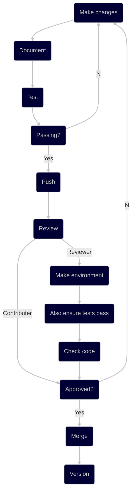

# Scihence

Henry's tools for doing science.

## Usage

Installation:
```zsh
pip install scihence
```

Importing:
```zsh
import scihence
```

## Development

### Workflow



### Setup

1. Ensure `pyenv` is installed on your device.
1. Substituting the Python version, run the following code in the terminal at the root of the repository directory:
    ```zsh
    make env v=z.y.z && source .venv/bin/activate
    ```

### Documentation

The live version of the documentation can be found [here](https://hennersbro98.gitlab.io/scihence).

At each PR, you should ensure that you have followed the following steps to make sure the documentation is up-to-date:
- When adding a new object to an existing sub-package:
  - this will simply only require writing the docstring for the required objects in the `.py` file, and then listing those objects that you would like to appear in the HTML documentation (i.e. those imported in the `__init__.py`) in the relevant `docs/source/python-api/*.rst` file.
- When adding a new sub-package (i.e. a new folder):
  - this will require creating a new `docs/source/python-api/*.rst` whose format can be copied across from an existing one.
> Note: You should only ever need to edit the `docs/source/python-api/*.rst` files, and never anything inside any of the folders within `docs/source/python-api`, since these are auto-generated.

To build documentation, in your environment run the following code in the terminal at the root of the repository directory:
```zsh
make doc
```

### Tests

In your environment, run the following code in the terminal at the root of the repository directory, replacing and including python versions that are supported:
```zsh
pyenv shell 3.a.b 3.c.d && tox
```

### Versions

> Note: Versioning should only occur for the master branch.

- Before merging, ensure that the version number listed in `src/scihence/__init__.py` is updated.
- If multiple branches are currently in review, try to liaise with those PR owners to ensure that version numbers are updated accordingly before merging.
